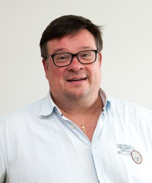

# SANSOX-SIVUSTON LOPPURAPORTTI — 2026-09-20
Kokoaa: kilpailijavertailu · ulkopuolisen testi · tekstin laatu · kuva-analyysi · tekoälyjäljet · kieliversiot (raportit 1–7). Ei toista niitä — tekee johtopäätökset.

---

## A. KOKONAISKUVA YHDELLÄ SIVULLA

**Tehtävä:** saada kunnallis- tai teollisuusinsinööri (ja Zaragozan kontaktit) vakuuttumaan, että OxTube on mitattu ja uskottava ratkaisu, joka ansaitsee 30 minuutin teknisen puhelun.

**Onnistuuko: OSITTAIN.** Näyttöarkkitehtuuri on nyt vahva: mitatut luvut lähteineen, julkaistu paperi ladattavissa, neljä referenssiä samalla rungolla ja tuote vihdoin näkyvissä. Mutta sivustolta puuttuu ihmiskerros (ei yhtään kasvoa alalla, jossa ostetaan ihmiseltä), kolme kantavaa faktaa on vahvistamatta, ja julkaisuinfrastruktuuri on demotasolla (JS-käännökset ovat hakukoneille näkymättömiä).

**Kokonaisarvosana: 7,5 / 10** (lähtötilanne ~4, kriittisen arvion hetkellä 6).
Vertailu parhaaseen kilpailijaan (Moleaer, ~9/10 resursseissa ja kiillossa): **voitamme näytön tiheydessä** — kummallakaan kilpailijalla ei ole vertaisarvioitua koetta lukuina sivullaan — ja **häviämme ihmisissä, resurssikerroksessa (datalehdet, mitoitustyökalut) ja hakunäkyvyydessä.** Kapea puolustettava asema (mitattu näyttö + alle sekunnin prosessi + energiattomuus) on nyt sivuston selkäranka, kuten strategiassa linjattiin.

**Kolme asiaa jotka toimivat — säilytettävä:**
1. **Näyttö ensin** -arkkitehtuuri: luvut lähteineen, References-sivun kuri (vain mitattua), rehelliset [TARKISTETTAVA]- ja 📷-merkinnät.
2. **Tuote näkyy**: aito asennuskuva + renderin mukainen 3D-malli + nimetty tuoteperhe (RadOx/IroX/UGOx/GasRemox/Lady Bug).
3. **Kolmikielisyys joka toimii**: kieli säilyy sivunvaihdossa, espanja on Espanjan espanjaa, desimaalipilkut kohdallaan — Zaragoza-valmis käyttökokemus.

**Kolme suurinta estettä:**
1. **Ei ihmisiä.** Nimikirjainpallot tiimikorteissa; ei yhtään sitaattia nimetyltä sansoxlaiselta (paitsi paperista). Henkilösuhdealalla tämä on kauppojen este, ei kosmetiikkaa.
2. **Vahvistamattomat kantavat faktat**: "yli 100 asennusta ~20 maassa", Pylkkäsen titteli, ja ennen kaikkea puuttuvat perusspeksit (virtaama-alue, kgO₂/kWh, painehäviö) — insinöörin kolme ensimmäistä kysymystä, joihin sivusto ei vastaa.
3. **Julkaisuinfra puuttuu**: JS-käännökset eivät indeksoidu, ei hreflangia, meta-tekstit vain englanniksi, ei hosting-päätöstä, demo-banneri päällä. Sivustoa ei voi julkaista tästä tilasta.

---

## B. RISTIRIIDAT JA JUURISYYT

**Juurisyy 1 — "Firma ei ole vielä antanut aineistoaan."** Lähes kaikki jäljellä olevat puutteet (kasvot, iso render, kumppanikuvat, faktat, patentit, speksit, IWA-lupa, hosting) palautuvat yhteen syyhyn: kaikki tähänastinen on rakennettu pelkistä julkisista lähteistä. **Yksi tapaaminen Seppälän kanssa sulkee ~70 % avoimista kohdista.** Lista on valmiina Notesissa.

**Juurisyy 2 — Demoarkkitehtuuri ≠ julkaisuarkkitehtuuri.** JS-käännökset, EN-metat, hreflangin puute ja analytiikan puute ovat kaikki seurausta samasta valinnasta (yksi HTML per sivu, käännökset skriptissä). Ratkaisu on yksi tekninen työ: **build-skripti, joka generoi /en/ /es/ /fi/ -hakemistot samoista sanakirjoista.** Ei kolmea käsin ylläpidettävää sivustoa — yksi lähde, kolme ulostuloa.

**Juurisyy 3 — Näyttö ilman ihmistä.** Sivusto todistaa että laite toimii, muttei että firmaan voi luottaa ihmisinä. Sama juurisyy selittää sekä kuvapuutteen että sitaattien puutteen. Korjaus ei ole "lisää kuvia" vaan ihmiskerros: kasvot + yksi aito lause per henkilö.

**Aiempien suositusten ristiriidat — ratkaistu:**
- *"Ei tekoälykuvia" vs. 3D-hero:* ei ristiriitaa — 3D on merkitty malliksi eikä esitä valokuvaa. Linja: synteettinen sallittu vain selvästi merkittynä teknisenä esityksenä.
- *"Vähemmän ylläpitopintaa" (B-rakenne) vs. toteutettu A (6 ovea):* päätös pysyy — A nyt; jos News-virta ei elä 6 kk:ssa, tiivistetään A→B (halpa suunta, kirjattu mittariin M5).
- *"Sama CTA joka sivulla" -kritiikki vs. kilpailijaoppi "yksi toistuva kehotus":* ratkaistu — muoto toistuu (opittavuus), ensimmäinen rivi vaihtuu sivuittain (aitous).
- *"3 sovellusta, ei 18" vs. Products-sivun 6 tuotetta:* ei ristiriitaa — 3 segmenttiä ovat ongelmia, 6 tuotetta välineitä. Kuri: uusi tuote sivulle vasta kun sillä on näyttöä.

---

## C. PARANNUSSUUNNITELMA

### AALTO 1 — pakolliset ennen julkaisua
| # | Mitä | Miksi (löydös) | Vaikutus | Työ | Kuka | Riippuu |
|---|---|---|---|---|---|---|
| 1 | Seppälä-tapaaminen: faktat, render, logo, luvat, speksit, hosting (lista Notesissa) | Juurisyy 1 | suuri | 1–2 h | ihminen | – |
| 2 | 3 kasvokuvaa puhelimella | Juurisyy 3, kuvaraportti | suuri | 15 min | ihminen | – |
| 3 | Team-osio kuvilla + 1 nimetty sitaatti (Pylkkänen) | Juurisyy 3 | suuri | 1 h | Claude | #2 |
| 4 | Build-skripti: /en/ /es/ /fi/ + hreflang + lokalisoidut title/meta/alt + privacy FI/ES | Juurisyy 2, kieliraportti A2–A5 | suuri | 4–6 h | Claude | – |
| 5 | [TARKISTETTAVA]-kohtien sulku (ClariOx, GasRemox, palvelut, 100+, titteli) | tekstiraportti | keski | 1 h | Claude | #1 |
| 6 | Tekniset speksit Technologylle (virtaama, kgO₂/kWh, painehäviö, liitännät) | este A2 | suuri | 2 h | Claude | #1 |
| 7 | Hosting-päätös + julkaisu (suositus: Cloudflare Pages, rinnakkaisosoite new.sansox.fi) | este A3 | keski | 0,5 h päätös + 2 h | molemmat | #4 |
| 8 | ES-natiivioikoluku | kieliraportti C | keski | 2–3 h | ihminen | #4 |
| 9 | Demo-bannerit pois + og:image omasta asennuskuvasta | julkaisuehto | pieni | 0,5 h | Claude | #7 |

### AALTO 2 — ensimmäinen kuukausi
| # | Mitä | Vaikutus | Työ | Kuka | Riippuu |
|---|---|---|---|---|---|
| 10 | Kumppanikuvat paikoilleen (Intia jälkeen, Filippiinit, Caviar) | keski | 1 h | Claude | pyynnöt #1:stä |
| 11 | Analytiikka (Cloudflare Analytics / Plausible) + mailto-tapahtumat | keski | 1 h | Claude | #7 |
| 12 | Substanssitaulukon täysi transkriptio (40+ ainetta paperista) | pieni | 2 h | Claude | – |
| 13 | Datalehti-PDF:t (OxTube, RadOx, IroX) — kilpailijoiden resurssikerros | keski | 4–6 h | molemmat | #6 |
| 14 | ES-landing oxifertirrigación-kulmalla Zaragozaa varten | keski | 3 h | Claude | #4 |

### AALTO 3 — myöhemmin
| # | Mitä | Huomio |
|---|---|---|
| 15 | News-prosessi: kuka kirjoittaa, kuinka usein — 6 kk tarkistuspiste; jos ei elä → A→B-tiivistys | mittari M5 |
| 16 | FAQ + karkea mitoitustyökalu | kilpailijaoppi |
| 17 | Video: 1 sekunnin kirkastuminen livenä (puhelinvideo koejärjestelystä) | vahvin mahdollinen todiste |
| 18 | Bangladesh/tekstiili-case kun JV konkretisoituu | odottaa liiketoimintaa |

---

## D. TOTEUTUSVALMIIT MUUTOKSET (aalto 1, Clauden osuudet — EI TOTEUTETTU, odottaa hyväksyntää)

Toteutus hyväksynnän jälkeen **uuteen versiokansioon** `~/Documents/sansox-site-v2/` (git säilyy; v1 jää vertailukohdaksi).

**D1 — Team-osio (company.html), kuvapaikat valmiina:**
```html
<div class="person">
  <b>Mauri Seppälä</b><span data-i18n="pe1r">CEO</span>
  <p data-i18n="pe1p">+358 500 603 020 · mauri.seppala@sansox.fi</p></div>
```
CSS: `.face{width:100%;aspect-ratio:4/5;object-fit:cover;border-radius:10px;margin-bottom:12px;filter:saturate(.92)}`
Sitaattipaikka: `<blockquote data-i18n="pq">"[PYLKKÄSEN LAUSE TAPAAMISESTA]"<footer>— Juhani Pylkkänen</footer></blockquote>`

**D2 — Build-skripti (build_i18n.py), toimintaperiaate:**
lue `*.html` → poimi `const T={...}` → generoi `/es/sivu.html` ja `/fi/sivu.html` joissa käännökset ajettu suoraan HTML:ään, `lang`-attribuutti vaihdettu, kielivalitsin linkittää hakemistojen välillä → lisää joka sivulle `<link rel="alternate" hreflang="en|es|fi|x-default">` → korvaa title/meta alla olevista.

Title + meta description ES/FI, valmiina (10 sivua — poimitaan skriptiin):
| Sivu | ES title / desc | FI title / desc |
|---|---|---|
| index | «SansOx — tecnología finlandesa de tratamiento de agua» / «OxTube disuelve gas en el agua en menos de un segundo. 90 % de fármacos eliminados, medido y publicado.» | «SansOx — suomalaista vedenkäsittelyteknologiaa» / «OxTube liuottaa kaasun veteen alle sekunnissa. 90 % lääkejäämistä poistettu — mitattu ja julkaistu.» |
| solutions | «Soluciones | SansOx» / «Aguas naturales, agua potable, agua residual — un tubo, tres segmentos.» | «Ratkaisut | SansOx» / «Luonnonvedet, juomavesi, jätevesi — yksi putki, kolme segmenttiä.» |
| products | «Productos — la familia OxTube | SansOx» / «OxTube, RadOx, IroX, UGOx, GasRemox y Lady Bug. Un principio, seis productos.» | «Tuotteet — OxTube-perhe | SansOx» / «OxTube, RadOx, IroX, UGOx, GasRemox ja Lady Bug. Yksi periaate, kuusi tuotetta.» |
| references | «Referencias | SansOx» / «Cuatro referencias medidas y trece crónicas desde el terreno.» | «Referenssit | SansOx» / «Neljä mitattua referenssiä ja kolmetoista raporttia kentältä.» |
| technology | «Tecnología | SansOx» / «Cuatro etapas dentro de un tubo sellado, en menos de un segundo.» | «Teknologia | SansOx» / «Neljä vaihetta suljetussa putkessa, alle sekunnissa.» |
| company | «Empresa | SansOx» / «Tres ingenieros en Lahti, Finlandia. Publicado en IWA, premiado por Water Europe.» | «Yritys | SansOx» / «Kolme insinööriä Lahdessa. IWA-julkaisu, Water Europe -palkinto.» |
| case-kuopio | «Caso Kuopio — 90 % de fármacos eliminados en 0,7 s | SansOx» / «El ensayo publicado por IWA, sustancia por sustancia.» | «Case Kuopio — 90 % lääkejäämistä 0,7 sekunnissa | SansOx» / «IWA:n julkaisema koe, aine aineelta.» |
| case-philippines | «Caso Filipinas — radón bajo 11 Bq/l | SansOx» / «Seis estaciones de bombeo bajo uno de los límites más estrictos del mundo.» | «Case Filippiinit — radon alle 11 Bq/l | SansOx» / «Kuusi pumppaamoa maailman tiukimpiin kuuluvan rajan alla.» |
| case-carelian | «Caso Carelian Caviar — ozono en acuicultura | SansOx» / «Disolución completa de ozono en 3 segundos en una granja de esturiones.» | «Case Carelian Caviar — otsoni vesiviljelyssä | SansOx» / «Otsonin täysi liukeneminen 3 sekunnissa sampilaitoksessa.» |
| case-india | «Caso Sukhrali — recuperación de un estanque | SansOx» / «Un estanque muerto revivido en Gurugram, India — y mantenido limpio.» | «Case Sukhrali — lammen elvytys | SansOx» / «Kuollut lampi elvytetty Gurugramissa — ja pidetty puhtaana.» |

**D3 — Speksiosio (technology.html), luvut Seppälältä:**
```html
<section><h2 data-i18n="sp_h">Engineering data</h2>
<div class="tablewrap"><table>
<tr><th data-i18n="sp_t1">Parameter</th><th data-i18n="sp_t2">Value</th></tr>
<tr><td data-i18n="sp_r1">Flow range</td><td class="v">[LUKU] m³/h</td></tr>
<tr><td data-i18n="sp_r2">Oxygen transfer</td><td class="v">[LUKU] kgO₂/kWh</td></tr>
<tr><td data-i18n="sp_r3">Pressure drop</td><td class="v">[LUKU] bar @ [LUKU] m³/h</td></tr>
<tr><td data-i18n="sp_r4">Connections</td><td class="v">DN[LUKU]–DN[LUKU]</td></tr>
</table></div></section>
```
ES: Datos de ingeniería / Parámetro / Valor / Rango de caudal / Transferencia de oxígeno / Pérdida de carga / Conexiones · FI: Tekniset tiedot / Suure / Arvo / Virtaama-alue / Hapensiirto / Painehäviö / Liitännät

**D4 — Julkaisusiivous:** poista `<div class="draft">` kaikilta sivuilta; og:image → `https://[DOMAIN]/assets/img/oxtube_installed_vertical.jpg`; robots + sitemap.xml generoidaan build-skriptissä.

**D5 — Privacy FI/ES:** valmiit lyhyet tekstit (sama sisältö kuin EN: ei evästeitä, ei analytiikkaa [päivitetään jos #11 toteutuu], vain sähköpostin tiedot; rekisterinpitäjä SansOx Oy, VAT FI24678326). Toimitetaan build-skriptin dictinä — ES-versio kiertää natiivioikoluvun (#8) kautta.

---

## E. IHMISEN TEHTÄVÄT
| Tehtävä | Kuka | DL-ehdotus |
|---|---|---|
| 3 kasvokuvaa puhelimella (ikkunavalo sivulta) | Juha / Seppälä | tapaamisessa, viim. 30.9. |
| Seppälä-tapaaminen: Notes-listan läpikäynti (faktat, render, logo, IWA-lupa, speksit) | Juha | ennen Zaragozan varmistumista, viim. 27.9. |
| Hosting- ja osoitepäätös (new.sansox.fi rinnalle vai Wixin tilalle) | Juha + Seppälä | 30.9. |
| Kuvapyynnöt kumppaneille eteenpäin (Unique Water, Carelian, Elixiir) | Seppälä | lokakuu |
| ES-natiivioikoluku (Zaragoza-kontakti tai ostettu, ~2–3 h) | Juha järjestää | ennen julkaisua |
| Pylkkäsen sitaattilause + tittelin vahvistus | Seppälä/Pylkkänen | tapaamisessa |
| Vanhan blogin tekoälykuvan poisto (uskottavuusriski) | Seppälä | lokakuu |

## F. MITTARIT — puolen vuoden tarkistus (ilmaistyökalut)
| # | Mittari | Miten mitataan | Tavoite 3/2027 |
|---|---|---|---|
| M1 | Tekniset yhteydenotot | mailto-klikit (analytiikka) + saapuneet puhelupyynnöt (postilaatikko) | ≥ 2/kk |
| M2 | Hakunäkyvyys 3 kielellä | Google Search Console: impressiot/klikit ("radon removal", "eliminación radón agua", "lääkejäämien poisto") | indeksoitu kaikilla kielillä; ≥ 500 impressiota/kk |
| M3 | ES-kävijöiden osuus | analytiikan kielijakauma | ≥ 20 % (Zaragoza-työn jälki) |
| M4 | Näytön käyttö | References+case-sivujen osuus istunnoista; paperin PDF-lataukset | ≥ 30 % · ≥ 10 latausta/kk |
| M5 | News-virran elävyys | uusien julkaisujen määrä | ≥ 3 / 6 kk — muuten A→B-tiivistys |

*Raportti: Claude, 2026-09-20 · commitit d0dc2d3…0c2c7ac · demo: http://localhost:9993 · artifakti (yksityinen): claude.ai/code/artifact/ba6d7e44*
